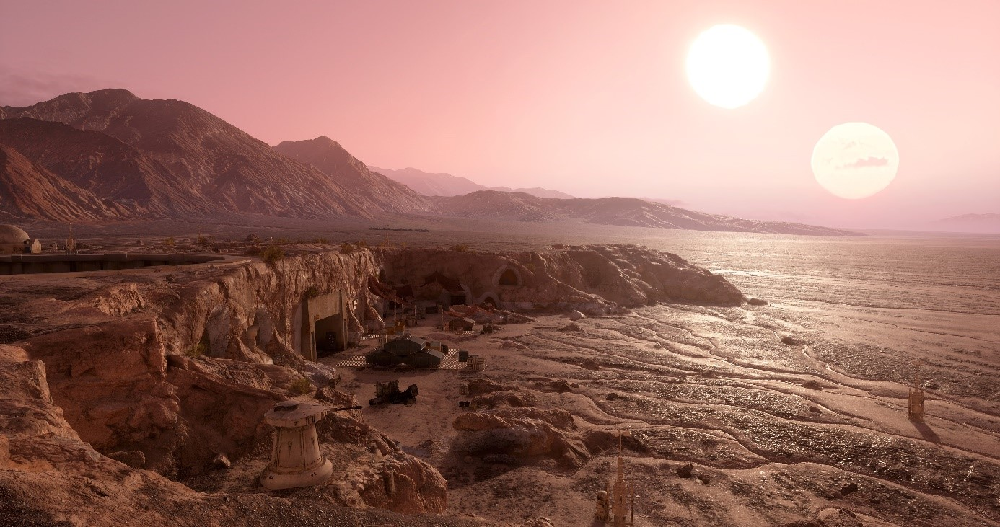

# DESAFIO B2W | API STAR WARS | Feito por: Alessio Paiva Bertolini

Update date: 2020-01-09

<p align="center">
    
</p>

### Bem vindo ao README do aplicativo API StarWars do desafio da empresa B2W

Projeto foi desenvolvido com arquitetura API REST conjunto ao Node.js, aplicados Design Pattern Service e Repository e DTO.
Sendo assim, com objetivo de gerenciar dados de planetas do filme Star Wars.
As operações do HTTP destina-se em cadastrar, listar e deletar dados de planetas.

**URL Base:** [http://localhost:27017/api-sw-node/](http://localhost:27017/api-sw-node/)

**URL da API Star Wars:** [https://swapi.dev/api/planet](https://swapi.dev/api/planet)

## Utilizados no Desenvolvimento ##

* Node.Js
* Express.Js
* MongoDb
* Visual Studio Code
* Json data (para retornar os dados)
* PostMan (testar a API criada utilizando as operações)

## Observações ##

É necessario configurar a chave do mongo no arquivo .env


### Instalando as configurações via cmd ##

Com cmd aberto digite a url do diretório do seu projeto

Exemplo:

cd "C:\Users\NomeDoComputador\Desktop\..."

------------------------
Node.js usa um gerenciador de pacotes de NPM, para iniciar o Node no seu projeto:

npm init

-------------------------------
Logo em seguida haverá configurações para inicializar o seu projeto:

Exemplo:

package name: (b2w-desafio-back-end-nodejs-swapi)  -- apertar enter

version: (1.0.0) -- apertar enter

keywords: -- apertar enter

license(ISC) -- apertar enter

Is this Ok? -- conferir e apertar enter

------------------------
Após configurar o seu projeto, em seguida será instalado todas as dependências listadas e definidas na pasta package.json

------------------------
Com comando abaixo e nome da sua dependência, será possível utilizá-la no projeto:
(Instalada no ambiente de produção)

npm install (nome da depedência)

------------------------
As depedências que foram usadas no projeto:

express - (Configura a rota das aplicações)

mongo - (Configura o Banco ao Node)

mongoose - (Ferramenta de modelagem de objetos do MongoDB trabalhada em um ambiente assíncrono)

dotenv - (Configura uma variável de ambiente, no qual foi usada para chave ao acesso ao MongoDB)

star-wars-api - (API Star Wars utilizada para aplicações do projeto)

------------------------

Para instalar apenas no ambiente de desenvolvimento:

npm install --save-dev (nome da dependência escolhida)

------------------------

Dependência instalada no ambiente desenvolvimento:

nodemon - (Ferramente utilizada para aplicações de carregamento automático)

------------------------
 
## PASSO A PASSO DAS EXECUÇÕES DO PROJETO

Para iniciar o projeto:

npm run dev (Para iniciar pelo ambiente de desenvolvimento)

ou

npm start (Para iniciar pelo ambiente de produção)

## Adicionar planeta

`POST /planet`

> Status 201

Request Body

```json
{
	  "name": "Naboo",
	  "climate": "Frio",
	  "terrain": "Relevo"
}

Response

```json

{
    "_id": "5f4ecad4660eac4944ed7b61",
    "name": "Hoth",
    "climate": "Frio",
    "terrain": "Relevo",
    "totalAppearances": 1
}
```

> Status 400 (Erro ao adicionar)

Response

```json

{
  "error":
  {
    "message": "Não foi possível adicionar o planeta",
  }
}
```

> Status 400 (Erro do nome já existente)

Response

```json

{
  "error":
  {
    "message": "Planeta já existente",
  }
}
```

## Listar todos os planetas

`GET /planets`

> Status 200

Response

```json

{
    "_id": "5f4ecad4660eac4944ed7b61",
    "name": "Hoth",
    "climate": "Frio",
    "terrain": "Relevo",
    "totalAppearances": 1
}
```

> Status 400

Response

```json

{
  "error":
  {
    "message": "Não foi possível encontrar os planetas",
  }
}
```

## Buscar planeta pelo nome

`GET /planet/name/name/Hoth`

> Status 200

Response

```json

{
    "_id": "5f4ecad4660eac4944ed7b61",
    "name": "Hoth",
    "climate": "Frio",
    "terrain": "Relevo",
    "totalAppearances": 1
}
```

## Listar todos os planetas com a primeira letra da busca

`GET /planets/H`

> Status 200

Response

```json

{
    "_id": "5f4ecad4660eac4944ed7b61",
    "name": "Hoth",
    "climate": "Frio",
    "terrain": "Relevo",
    "totalAppearances": 1
}
```

> Status 400

Response

```json

{
  "error":
  {
    "message": "Não foi possível encontrar o planeta",
  }
}
```


## Buscar planeta pelo id

`GET /planet/id/5f4ecad4660eac4944ed7b61`

> Status 200

Response

```json

{
    "_id": "5f4ecad4660eac4944ed7b61",
    "name": "Hoth",
    "climate": "Frio",
    "terrain": "Relevo",
    "totalAppearances": 1
}
```

> Status 404

Response

```json
{
  "error":
  {
    "message": "Não foi possível encontrar o planeta",
  }
}
```


## Remover planeta pelo id

`DELETE /planet/5f4ecad4660eac4944ed7b61`

> Status 204

Response

```json

```

> Status 404

```json
{
  "error":
  {
    "message": "Não foi possível encontrar o planeta",
  }
}
```

Dúvidas e/ou sugestões enviar email para: alessio.bertolini@gmail.com